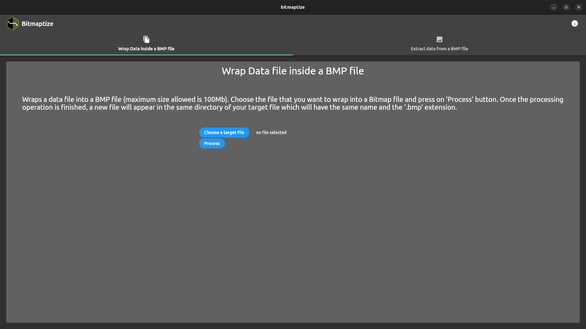
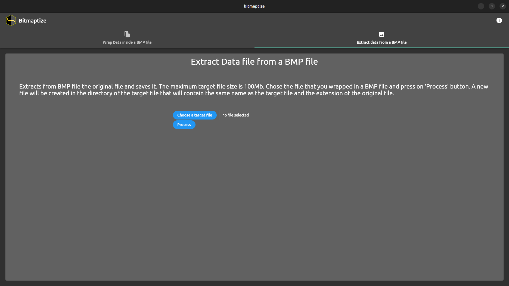

# Bitmaptize

Wraps data to .bmp and extracts data from .bmp.

# What is Bitmaptize?

Bitmaptize first of all is an experiment with the bitmap files. It is an application that allows to wrap any file into a bitmap file and viceversa.

The result of the wrapping data to .bmp file is like this:

I want to clarify that Bitmaptize does not allow to encrypt or hide data, it simply takes the content of a file and wraps it in a bmp file so that , a .zip or a .exe file for example, can be viewed and shared as an image.

For data encryption, please refer to other softwares like [Crypton](https://snapcraft.io/crypton).

# Download (for Ubuntu)

# Screenshots

|                 Screenshots                 |                                             |
| :-----------------------------------------: | :-----------------------------------------: |
|  |  |

If you found a bug, please [contact me](http://andre-i.eu/#contactme).
